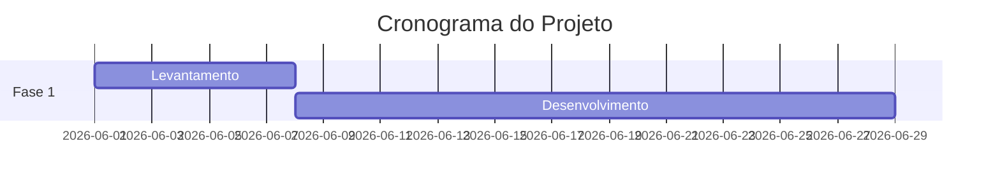

# Pandora OS — Instruções Operacionais

Documento mestre. Sempre que algo mudar na arquitetura, infra, schema ou processo, **atualize este arquivo**.

---

## Sobre o Projeto

Sistema operacional da **Pandora Tech LTDA** (Mario Campello). Centraliza:

- Monitoramento de WhatsApp (uazapi) e email (Gmail)
- Detecção de oportunidades via AI
- CRM com perfil unificado de clientes/prospects
- Geração de propostas e contratos com AI
- Financeiro (Asaas, custo por projeto)
- Telegram Bot como canal de alertas

PRD completo: `/Users/mcampello/Library/CloudStorage/GoogleDrive-mario@campello.me/Meu Drive/Pandora Tech LTDA/Proposta/PRD/`

---

## Stack

| Camada | Tecnologia |
|--------|-----------|
| Frontend + API | Next.js 16 (App Router, Turbopack) |
| Linguagem | TypeScript |
| Estilos | CSS variables (design system Pandora) + Tailwind v4 |
| Banco | Supabase (Postgres + Auth + Storage) |
| Auth | Supabase Auth (email + senha) |
| Container | Docker + docker compose |
| Reverse proxy | Caddy 2 (HTTPS automático via Let's Encrypt) |
| Hospedagem | VPS Ubuntu 24.04 |
| Versionamento | Git + GitHub |
| AI (LLMs) | OpenRouter — modelo default: `anthropic/claude-sonnet-4.5` (helper em `src/lib/ai.ts`) |

---

## Acesso

### VPS
- IP: `76.13.174.139`
- Usuário: `root`
- Autenticação: SSH key (chave do Mario já em `authorized_keys`)
- Conectar: `ssh root@76.13.174.139`

### Ambientes

| Ambiente | URL | Branch | Container | Supabase |
|----------|-----|--------|-----------|---------|
| **Produção** | https://app.campello.me | `main` | `pandora-os` | Pandora Zap (`wxvqwzygabzelspdwgcg`) |
| **Dev** | https://dev.campello.pro | `dev` | `pandora-os-dev` | pandora-os-dev (preencher em `.env.dev`) |

**Worktrees no VPS:**
- `/root/pandora-os` — branch `main` (prod)
- `/root/pandora-os-dev` — branch `dev` (dev)

**Deploy:**
```bash
bash /root/pandora-os/scripts/deploy-prod.sh  # main → app.campello.me
bash /root/pandora-os/scripts/deploy-dev.sh   # dev  → dev.campello.pro
```

### GitHub
- Repo: `git@github.com:mcampello/pandora-os.git`
- Branches: `main` (prod), `dev` (dev)
- Deploy key configurada no VPS (chave SSH em `/root/.ssh/id_ed25519`)

### Supabase
- **Prod:** Pandora Zap · ID `wxvqwzygabzelspdwgcg` · sa-east-1
- **Dev:** pandora-os-dev · criar após pausar projeto antigo do docs · preencher em `.env.dev`

### Login no app
- Email: `mario@campello.me`
- Senha: definida no Supabase Auth (não commitar aqui)

---

## Estrutura de Arquivos

```
/root/pandora-os/
├── Dockerfile               # Node 20 Alpine, npm run dev
├── docker-compose.yml       # Container na rede docs-site_docs_net
├── next.config.ts           # allowedDevOrigins: app.campello.me
├── .env.local               # Vars Supabase (NÃO commitar)
├── .gitignore
├── public/                  # Assets (pandora_ico.svg, logos)
└── src/
    ├── middleware.ts         # Proteção de rotas via Supabase Auth
    ├── lib/
    │   ├── ai.ts             # Helper OpenRouter (claude-sonnet-4.5)
    │   ├── calcom.ts         # Integração Cal.com
    │   ├── docs.ts           # Geração de documentos
    │   ├── export.ts         # Exportação
    │   ├── fathom.ts         # Integração Fathom
    │   ├── google.ts         # OAuth Google (Calendar + Gmail)
    │   ├── opportunities.ts  # Lógica de detecção de oportunidades
    │   ├── portal-auth.ts    # Auth do portal do cliente
    │   ├── supabase-admin.ts # Client admin (service role)
    │   ├── supabase-browser.ts
    │   ├── supabase-server.ts
    │   ├── types.ts          # Tipos compartilhados
    │   └── uazapi.ts         # Envio de WhatsApp via uazapi
    ├── components/
    │   ├── Sidebar.tsx
    │   ├── AgentChat.tsx     # Chat do agente central (web)
    │   ├── DocEditor.tsx
    │   ├── DocViewerClient.tsx
    │   └── FormUI.tsx
    └── app/
        ├── layout.tsx        # Root layout (html, body, fontes)
        ├── globals.css       # Design system tokens
        ├── login/page.tsx    # Tela de login
        ├── (app)/            # Rotas protegidas (requer auth)
        │   ├── layout.tsx    # Shell com Sidebar
        │   ├── page.tsx      # Dashboard
        │   ├── agente/       # Interface web do agente central
        │   ├── clientes/     # Lista + [id] detalhe + novo
        │   ├── empresas/     # Lista de empresas
        │   ├── oportunidades/ # Kanban + lista
        │   ├── propostas/    # Lista + [id] detalhe + novo
        │   ├── contratos/    # Lista + [id] detalhe + novo
        │   ├── operacao/     # Índice de clientes ativos
│   │   └── [id]/     # Operação full-screen: kanban iniciativas + reuniões
        │   └── configuracoes/conectores/
        ├── api/
        │   ├── agent/chat/           # POST — agente central (web + telegram)
        │   ├── dashboard/            # GET — stats + tasks + activity
        │   ├── ai/improve/           # Melhoria de texto via AI
        │   ├── client-documents/[id]/ # Documentos por cliente
        │   ├── clients/[id]/         # CRUD clientes
        │   ├── companies/[id]/       # CRUD empresas
        │   ├── connectors/           # calcom, fathom, gcalendar, gmail, whatsapp
        │   ├── contacts/[id]/        # CRUD + suggestions + sync-whatsapp
        │   ├── contracts/[id]/agent/ # CRUD + agente AI
        │   ├── deliverables/[id]/    # CRUD + suggest
│   ├── initiatives/[id]/     # CRUD iniciativas
│   ├── initiative-tasks/[id]/ # CRUD tarefas de iniciativas
        │   ├── hours/[id]/           # CRUD horas
        │   ├── interactions/         # Log de interações
        │   ├── meetings/             # Reuniões (Fathom)
        │   ├── opportunities/[id]/   # CRUD oportunidades
        │   ├── portal/[slug]/        # API do portal do cliente
        │   ├── portals/[id]/         # CRUD portais
        │   └── proposals/[id]/       # CRUD + generate + import-pdf
        ├── view/                     # Viewers públicos (sem auth)
        │   ├── p/[id]/               # Viewer público de proposta
        │   └── c/[id]/               # Viewer público de contrato
        └── portal/[slug]/            # Portal do cliente (acesso externo)
```

---

## Workflow de Desenvolvimento

**Todo desenvolvimento é direto no VPS via SSH.** Não há cópia local.

### Editar arquivo
```bash
ssh root@76.13.174.139
nano /root/pandora-os/src/app/...
```

Next.js (Turbopack) faz HMR automático — alterações aparecem em segundos em https://app.campello.me

### Reiniciar container (mudanças em .env ou docker-compose)
```bash
ssh root@76.13.174.139 "docker restart pandora-os"
```

### Logs
```bash
ssh root@76.13.174.139 "docker logs pandora-os --tail=50 -f"
```

### Commit e push
```bash
ssh root@76.13.174.139 "cd /root/pandora-os && git add -A && git commit -m '...' && git push origin main"
```

---

## Design System

Tokens em `src/app/globals.css`.

### Cores
- Brand: `--pandora-violet-600` (#7A1CB5)
- Surface dark: `--pandora-violet-950` (#0D0219)
- Accent verde: `--pandora-green-400` (#2DD4A0)
- Neutros: `--pandora-ink-{0-900}`

### Tipografia
- Display: Chakra Petch (títulos, eyebrows, labels)
- Texto: Sora (corpo, descrições)
- Mono: JetBrains Mono (timestamps, código)

### Componentes (classes CSS)
- `.pda-side` / `.pda-main` — layout
- `.pda-topbar` — barra superior das páginas
- `.pda-content` — área de conteúdo
- `.pda-card` — cards
- `.pda-btn` / `.pda-btn-ghost` — botões
- `.pda-badge-{success|warning|danger|violet|green}` — badges
- `.pda-dot-{green|amber|gray}` — dots de status
- `.pda-chip` — chip de contexto
- `.pda-eyebrow` — labels uppercase
- `.pda-empty` — empty states

### Diagramas e gráficos em documentos
Propostas, contratos e qualquer documento `content_md` suportam **diagramas Mermaid** nativamente — renderizados com estética Pandora (violet + green). Use blocos de código com linguagem `mermaid`:

````markdown

````

Tipos úteis: `flowchart LR/TD`, `gantt`, `sequenceDiagram`, `pie`, `timeline`, `mindmap`, `xychart-beta`. Tabelas GFM também são renderizadas com estilo Pandora. **Sempre use Mermaid quando for visualizar processos, cronogramas, fluxos ou comparações** — não descreva em texto algo que um diagrama mostraria melhor.

---

## Schema do Banco

### `auth.users` (Supabase Auth)
Usuário admin: `mario@campello.me`. Identity em `auth.identities` (provider: email).

### `companies` — empresas (entidade central do CRM)
Liga contacts, clients, opportunities, proposals e contracts.

| Coluna | Tipo | Notas |
|--------|------|-------|
| id | uuid | PK |
| name | text | obrigatório |
| cnpj | text | |
| website | text | |
| industry | text | setor de atuação |
| size | text | startup / pequena / media / grande / enterprise |
| notes | text | |
| address_street, address_number, address_complement | text | endereço |
| address_city, address_state, address_zip | text | endereço |
| responsible_contact_id | uuid | FK contacts — responsável pelo contrato |

### `contacts` — pessoas/entidades
Identidade unificada que liga email, WhatsApp e reuniões.

| Coluna | Tipo | Notas |
|--------|------|-------|
| id | uuid | PK |
| name | text | obrigatório |
| company_id | uuid | FK companies |
| email, phone, company, role, linkedin_url, website | text | |
| source | text | whatsapp / email / fathom / calcom / manual / indication |
| tags | text[] | |
| notes | text | |
| ai_summary | text | resumo gerado por AI |
| ai_summary_updated_at | timestamptz | |
| last_whatsapp_at | timestamptz | atualizado por trigger ao inserir interaction channel=whatsapp |
| last_email_at | timestamptz | atualizado por trigger ao inserir interaction channel=email |
| last_meeting_at | timestamptz | atualizado por trigger ao inserir interaction channel=calcom/gcalendar/fathom |

### `clients` — relacionamento comercial

| Coluna | Tipo | Notas |
|--------|------|-------|
| id | uuid | PK |
| contact_id | uuid | FK contacts |
| company_id | uuid | FK companies |
| company_name | text | nome de exibição |
| status | text | prospect / active / paused / former |
| monthly_fee | numeric | R$/mês |
| dedication_hours | int | horas/mês |
| contract_start, contract_end | date | |
| renewal_auto | bool | default true |
| health_score | int | 1–10, risco de churn |
| health_notes | text | |
| health_updated_at | timestamptz | |

### `opportunities` — oportunidades detectadas

| Coluna | Tipo | Notas |
|--------|------|-------|
| contact_id | uuid | FK contacts |
| company_id | uuid | FK companies |
| channel | text | whatsapp / email / calcom / manual / group |
| confidence | text | very_high / high / medium / low |
| title, description, raw_content, source_url | text | |
| status | text | new / qualified / dismissed / converted |
| detected_at, qualified_at | timestamptz | |
| converted_to_client_id | uuid | FK clients |

### `proposals` — propostas (versionadas)
Múltiplas versões agrupadas por `proposal_group_id`.

| Coluna | Tipo | Notas |
|--------|------|-------|
| client_id | uuid | FK clients |
| opportunity_id | uuid | FK opportunities |
| company_id | uuid | FK companies |
| proposal_group_id | uuid | agrupa versões |
| version | int | |
| title, content_md | text | markdown |
| value | numeric | |
| status | text | draft / sent / viewed / accepted / rejected / expired |
| viewer_url | text | URL pública |
| sent_at, viewed_at, responded_at | timestamptz | |

### `contracts` — contratos (versionados)
`contract_group_id` agrupa versões. Suporta diff visual entre versões e assinatura digital.

| Coluna | Tipo | Notas |
|--------|------|-------|
| client_id | uuid | FK clients |
| opportunity_id | uuid | FK opportunities |
| company_id | uuid | FK companies |
| contract_group_id, version | uuid, int | |
| title, content_md | text | |
| value | numeric | |
| status | text | draft / in_review / signed / active / ended / cancelled |
| starts_at, ends_at | date | |
| signed_at | timestamptz | |
| signature_provider, signature_external_id | text | clicksign / d4sign etc |
| billing_type | text | mensal / fechado |
| billing_day | int | dia do mês para faturar (contratos mensais) |

### `contract_contacts` — pessoas vinculadas a um contrato (financeiro)

| Coluna | Tipo | Notas |
|--------|------|-------|
| id | uuid | PK |
| contract_id | uuid | FK contracts (cascade) |
| contact_id | uuid | FK contacts (cascade) |
| role | text | ex: decisor, financeiro, técnico |

### `invoices` — notas fiscais e cobranças

| Coluna | Tipo | Notas |
|--------|------|-------|
| id | uuid | PK |
| contract_id | uuid | FK contracts |
| company_id | uuid | FK companies |
| client_id | uuid | FK clients |
| month | date | mês de referência (sempre dia 1) |
| number | text | número da NF |
| amount | numeric | valor |
| status | text | pendente / emitida / paga / cancelada |
| due_date | date | vencimento |
| issued_at, paid_at | timestamptz | |
| asaas_id | text | reservado para integração Asaas |
| notes | text | |

### `initiatives` — iniciativas por cliente (roadmap operacional)

| Coluna | Tipo | Notas |
|--------|------|-------|
| id | uuid | PK |
| client_id | uuid | FK clients (cascade) |
| title | text | obrigatório |
| description | text | |
| status | text | backlog / active / paused / done |
| priority | int | 1–5, opcional |
| start_date, due_date | date | |

### `initiative_tasks` — tarefas dentro de uma iniciativa

| Coluna | Tipo | Notas |
|--------|------|-------|
| id | uuid | PK |
| initiative_id | uuid | FK initiatives (cascade) |
| title | text | obrigatório |
| status | text | todo / in_progress / blocked / done |
| assignee | text | responsável (texto livre) |
| due_date | date | |
| sort_order | int | ordenação dentro da iniciativa |

### `deliverables` — entregas mensais por cliente

| Coluna | Tipo | Notas |
|--------|------|-------|
| client_id | uuid | FK clients (cascade) |
| month | date | sempre dia 1 do mês (ex: 2026-05-01) |
| title | text | descrição da entrega |
| done | bool | default false |
| notes | text | |
| due_date | date | prazo opcional |

### `hours_entries` — horas dedicadas por cliente

| Coluna | Tipo | Notas |
|--------|------|-------|
| client_id | uuid | FK clients (cascade) |
| date | date | data do lançamento |
| hours | numeric(5,2) | ex: 1.5, 2.0 |
| description | text | |

### `interactions` — log unificado por contato

| Coluna | Tipo | Notas |
|--------|------|-------|
| contact_id | uuid | FK contacts |
| channel | text | email / whatsapp / fathom / calcom / manual |
| type | text | message_in / message_out / meeting / email_in / email_out / booking / note |
| subject, summary, content | text | |
| external_id, external_url | text | id/link na fonte |
| metadata | jsonb | dados específicos do canal |
| occurred_at | timestamptz | |

### `connectors` — conexões com serviços externos
Armazena credenciais e status de cada integração (whatsapp, gmail, gcalendar, calcom, fathom).

### `task_rules` — regras do agente de tarefas
Cada regra built-in tem um `rule_key` único. `ai_generation_count` rastreia quantas vezes a AI gerou tarefas com aquela chave. Quando `ai_generation_count >= 3`, `metadata.flagged_for_promotion = true` (banner na UI).

Função SQL: `increment_rule_count(p_rule_key text)` — incrementa contador e atualiza flag.

Regras built-in: `whatsapp_unanswered_6h`, `opportunity_stale_7d`, `proposal_unviewed_5d`, `deliverable_due_3d`, `client_inactive_30d`, `meeting_no_followup_24h`.

### `tasks` — fila de tarefas inteligente

| Coluna | Tipo | Notas |
|--------|------|-------|
| id | uuid | PK |
| title | text | obrigatório |
| status | text | open / done / dismissed |
| priority | text | critical / high / medium / low |
| source | text | manual / rule / ai |
| rule_key | text | FK task_rules.rule_key (nullable) |
| entity_type | text | contact / client / opportunity / proposal / deliverable |
| entity_id | uuid | ID da entidade vinculada |
| ai_reasoning | text | explicação da AI |
| dedup_key | text | UNIQUE — impede duplicatas por situação |
| due_at | timestamptz | prazo opcional |
| done_at / dismissed_at | timestamptz | timestamps de resolução |
| metadata | jsonb | dados extras |

RLS: `authenticated` full access + `anon` full access (necessário pois `SUPABASE_SERVICE_ROLE_KEY` não está configurado — admin client cai para anon key; segurança mantida via `AGENT_SECRET` no HTTP).

### `agent_messages` — histórico de conversa do agente central
Persistência das mensagens trocadas com o agente (Telegram e Web).

| Coluna | Tipo | Notas |
|--------|------|-------|
| id | uuid | PK |
| channel | text | `telegram` / `web` (CHECK) |
| role | text | `user` / `assistant` (CHECK) |
| content | text | obrigatório |
| tool_calls | jsonb | tool calls pendentes/executados (null se não houver) |
| created_at | timestamptz | default now() |

Índice `idx_agent_messages_channel_created (channel, created_at DESC)`.

### `public.documents` — mensagens WhatsApp vetorizadas
Ingeridas pelo N8N. **Não duplicar esta ingestão.** Tabelas relacionadas: `groups`, `participants`, `group_participants`.

### Triggers
`update_updated_at()` aplicado em todas as tabelas com `updated_at`.

### RLS
Todas as tabelas com Row Level Security ativo. Política: `authenticated` tem full access (1 usuário admin).

---

## Roadmap

- [x] Shell do app (sidebar, dashboard, design system)
- [x] Conectores (UI + tabela no banco)
- [x] Autenticação (Supabase Auth + middleware)
- [x] Schema completo (companies, contacts, clients, opportunities, proposals, contracts, deliverables, hours_entries, interactions)
- [x] Tela de Clientes (lista + perfil unificado + novo)
- [x] Tela de Empresas (/empresas)
- [x] Tela de Oportunidades (kanban + lista, API GET/PATCH)
- [x] Propostas (lista + drawer + viewer público /view/p/[id] + geração + import PDF)
- [x] Contratos (lista + drawer + viewer público /view/c/[id] + agente AI)
- [x] Módulo Operação (/operacao) — índice de clientes ativos com navegação para /operacao/[id]
- [x] Operação por cliente (/operacao/[id]) — kanban de iniciativas (backlog/active/paused/done) com tarefas ricas (todo/in_progress/blocked/done), painel de reuniões/transcrições, health score, fee e horas no header
- [x] Portal do cliente (/portal/[slug])
- [x] Módulo Financeiro (/financeiro) — lista de contratos ativos com KPIs (MRR, NFs pendentes), detalhe por contrato com 4 abas: Cliente (cadastro CNPJ/endereço/responsável), Escopo (markdown + condições), Pessoas (contacts + reuniões Fathom), Faturamento (NFs/invoices CRUD)
- [x] Sistema de Tarefas Inteligente — agentes de background (`/api/agents/scan` + `/api/agents/ai-scan`), fila priorizada (`/tarefas`), TaskBell no topbar, widget no dashboard, contextual no perfil de contato
- [x] Sync automático a cada 30 min — crontab no VPS chama `POST /api/sync/all` com `Authorization: Bearer {AGENT_SECRET}` → sincroniza WhatsApp, Gmail e Google Calendar. Log em `/var/log/pandora-sync.log`.
- [x] Cal.com webhook — `POST /api/connectors/calcom/webhook` processa BOOKING_CREATED/RESCHEDULED em tempo real (registrar URL no Cal.com: `https://app.campello.me/api/connectors/calcom/webhook`).
- [x] Última atualização real dos contatos — trigger Postgres `trg_interaction_update_contact_channels` atualiza `contacts.last_whatsapp_at/last_email_at/last_meeting_at` a cada INSERT/UPDATE em `interactions`.
- [x] Agente central como **dock contextual à direita** (`AgentDock`, montado no `AppShell`) — presente em toda tela `(app)`, empurra o conteúdo, persiste estado, abre via FAB ou item "Agente" do Sidebar. Ciente da tela atual (`page_context`) e atualiza a página após escritas (`router.refresh` / navega para o doc criado). Ferramentas de escrita (contato/cliente/oportunidade/proposta/contrato) com confirmação; geração AI de proposta/contrato via `src/lib/doc-generation.ts`.
- [x] `SUPABASE_SERVICE_ROLE_KEY` configurada em `.env.local` (admin client usa service role e bypassa RLS; políticas `anon` viram redundantes mas seguem inertes)
- [ ] N8N: configurar 2 HTTP Request nodes — scan (1h) e ai-scan (6h) → `https://app.campello.me/api/agents/*` com `Authorization: Bearer {AGENT_SECRET}`
- [ ] Gmail OAuth real
- [ ] Telegram Bot
- [ ] Detector de oportunidades (AI)
- [~] Propostas com AI — geração via agente (dock) OK; refinar fluxo no DocEditor
- [ ] Contratos com versionamento + diff visual (geração via agente OK; falta diff entre versões)
- [ ] Integração Fathom (reuniões)
- [ ] Integração Cal.com
- [ ] Integração Asaas (vincular invoices com Asaas)

---

## Outros Serviços no VPS

| Domínio | Serviço |
|---------|---------|
| docs.campello.me | Pandora Sales (propostas/contratos via Caddy) |
| automate.campello.pro | N8N |
| chat.campello.me | Open WebUI |
| design.campello.me | Penpot |
| slides.campello.me | Presonton |
| lp.campello.me | Landing page |

Caddy config: `/root/pandora-skills/deploy/docs-site/Caddyfile`

---

## Notas e Decisões

- **Mensagens de WhatsApp** são inseridas no Supabase pelo **N8N** na tabela vetorial `public.documents`. **Não duplicar essa ingestão.** A conexão uazapi (`pandora.uazapi.com`) é exclusivamente para **enviar** mensagens. Para ler conversas, consulte `public.documents`.

- **N8N** existe no VPS mas o Pandora OS **não depende dele**. Todos os webhooks são API routes do próprio Next.js. N8N fica para automações pontuais. Exception: N8N deve chamar `/api/agents/scan` (1h) e `/api/agents/ai-scan` (6h) com `Authorization: Bearer $AGENT_SECRET`.

- **AGENT_SECRET**: variável de ambiente que protege os endpoints de agentes (`/api/agents/*`). Definida em `.env.local`. Necessário configurar na produção.

- **Supabase** é o único banco. Vetores do WhatsApp já estão lá em base separada.

- **Telegram Bot** será o canal central de alertas — agente conversacional para Mario tirar dúvidas sobre clientes e receber notificações.

- **Atribuição de custo por projeto** ainda em aberto — definir critério (manual? por período? por tag?).

- **Render da área autenticada é client-only.** O `AppShell` (`src/components/AppShell.tsx`) só renderiza o shell após montar no cliente (`useEffect` → `mounted`); antes disso devolve um loader (`.pda-shell-boot`). Motivo: extensões de navegador (ex. Dashlane) injetam atributos `data-*` em inputs/buttons/textareas antes do React hidratar, disparando **hydration mismatch** que `suppressHydrationWarning` não resolve em escala (não cascateia). Sem HTML do servidor para o shell, não há comparação de hidratação. Tradeoff aceito: a área autenticada perde SSR (sem impacto — é atrás de login, sem SEO, e as telas já buscam dados no cliente). Ao criar telas novas dentro de `(app)`, **não** é preciso adicionar `suppressHydrationWarning` em formulários.

- **Agente lateral (`AgentDock`)** é um trilho persistente à direita: recolhido vira faixa de 56px (`.pda-dock-rail`), expande para 400px com o chat. Não há mais FAB flutuante. Em telas `< 768px` o estado aberto vira overlay.

---

## Como Manter Este Documento

Sempre que houver mudança em:
- Arquitetura (nova lib, mudança de stack)
- Banco (nova tabela, migração)
- Infra (novo container, mudança no Caddy, novo domínio)
- Credenciais ou acessos
- Decisões importantes
- Status do roadmap

→ **Edite este arquivo no mesmo commit da mudança.**
